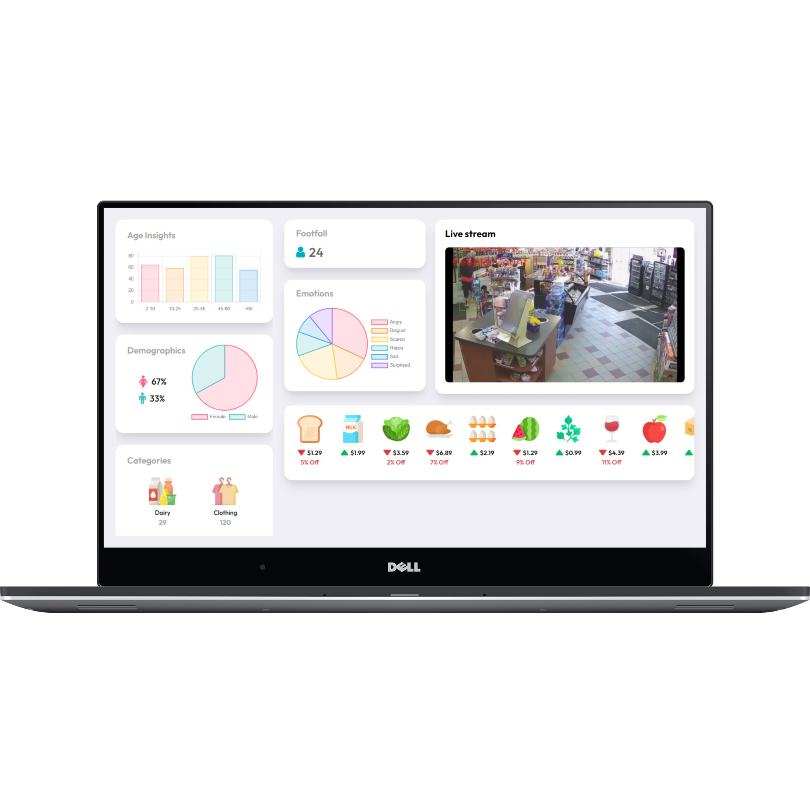

# Circle

    We provide next generation shopping experience for customers of tomorrow 

## Inspiration
Grocery stores in the US throw away an average of 43 billion pounds of food items in the garbage because they are not able to sell the products on time before expiry. Due to this, they incur huge losses. Moreover, they are unable to compete against giants in the industry because of their huge supply chains and the backing of intelligent systems.

## What it does

Therefore to solve this issue, we have come up with a solution that uses state of the art Artificial intelligence algorithms to come up with dynamic pricing for all the products in the store based on factors like expiry, climate conditions, customer demographics, and engagement, so that maximum number of items are sold in their best possible condition while ensuring profits for the owners. 

So for instance, if I’m selling bread at my store and the expiry date is approaching soon but no one is purchasing the bread, then our AI will reduce the price to a number at which it’s most likely to get sold on time. Another example is, according to the customer’s footfall and their engagement, the AI will either reduce or increase the price of products.
So let me give you a demo of our dashboard.

## Tech Stack

Using Python, React, Open cv , Open Vino

 
 
## Overview of Dashboard:

