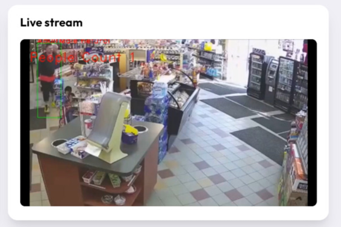

# Circle

## Inspiration
Approximately 40 M  pounds of food is thrown away each year in the US by grocery stores, as they are unable to sell the products on time before they expire. Consequently, they suffer massive losses. In addition, they are unable to compete against industry giants, because they have massive supply chains and intelligent systems to back them up.

## What it does

In order to resolve this issue, we have developed a solution that uses state of the art Artificial Intelligence algorithms in order to determine dynamic pricing for all the products in the store based on variables like expiry, climate conditions, customer demographics, and engagement,, ensuring that the maximum number of items are sold in the best condition while ensuring profits for the owners.

Thus, if I'm selling an item at my store and the expiry date is approaching soon, but no one is purchasing the bread, then our AI will reduce its price to a number at which it's most likely to be sold on time,Therefore, AI will either lower or raise the price of products. Let me show you our dashboard.

## Tech Stack

Using Python, React, Open cv , Open Vino

 
 
## Overview of Dashboard:

# In depth view of Dashboard

 
